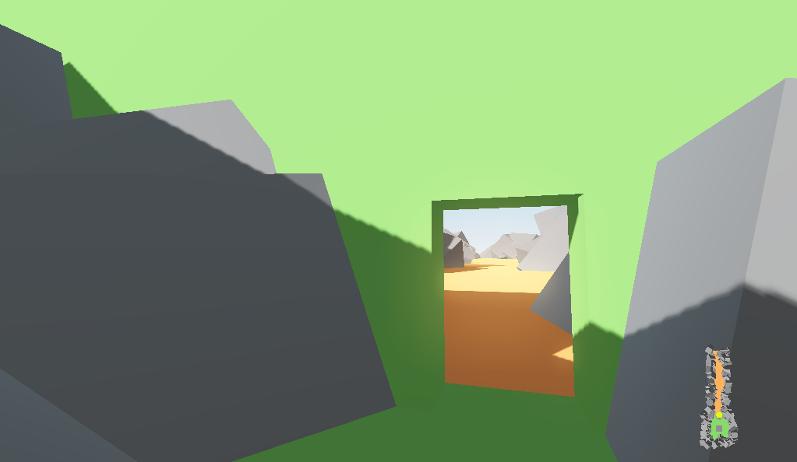

# Zone Loading System

This is a zone loading system that dynamically loads zones according to the player position in the background, this allows huge game worlds without loading screen.

The zones can be as big or as small as needed, and this can be combined with other optimization methods. If done carefully, the zone transitions will be invisible to the player.

It can be used for indoor and outdoor environments. It can also work for 2D with minor modifications.

- Every zone sits inside a trigger area that completely englobes the zone.
- When the player enters a trigger area, the corresponding zone is loaded (if not already) and attached to the world.
- When the player exits the area, the zone is removed from the tree but stays in memory, allowing to go back and forth quickly between the two zones. When the zone is not directly connected to an area the player is in, it is then freed from memory and unloaded.
- Connected zones are zones that are overlapping the current zone, this is detected automatically, no need to register the connections.
- Zones that are connected to the current zone(s) are automatically loaded in memory and instanced in background, so that they are ready when the player enters a new zone.

## Pros
- No loading screen during the game.
- Works for 2D and 3D.
- The next zone is loading in background mode while the player explores the current map.
- Connected zones are automatically detected.

## Cons
- Need to manually split the game world into zones and set triggers.
- Zones need to be carfully designed so that they are occluded when not visible (needs turns and twists).

## Contribute

Please report any issues here: https://godotforums.org/discussion/23868/zone-loading-system
You are free to contribute and improve this demo and do whatever you want with the code, this is a [Creative Commons](https://creativecommons.org/publicdomain/zero/1.0/)

