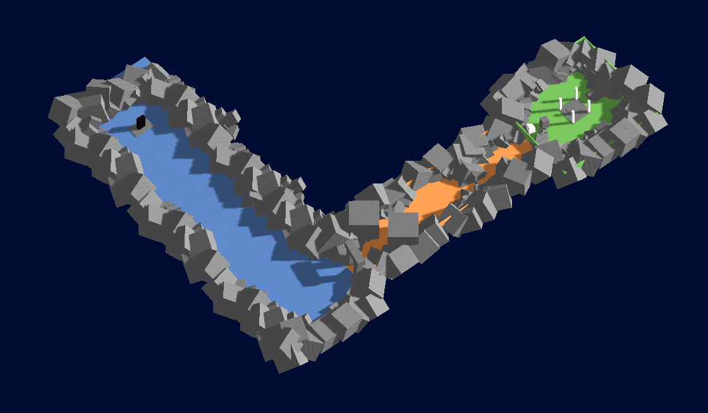

# Zone Loading System

This is a dynamic zone loading system for Godot that takes care of the zone management for you, loading and unloading zones as your player explores the world, using a background thread to minimize performance hiccups. This allows to have huge seamless worlds without loading screen.

The zones can be as big or as small as needed, and this can be combined with other optimization methods. If done carefully, the zone transitions will be invisible to the player, but for that you will need to break line of sight using twists and turns, so that the player can never see unloaded zones.

This system can be used for indoor and outdoor environments. It also works for 2D (example included).

- Every zone sits inside a trigger area that completely encompasses the zone.
- When the player enters a trigger area, the corresponding zone is loaded, instanced (if not already) and attached to the world.
- When the player exits the area, the zone is removed from the tree but stays in memory, allowing to go back and forth quickly between two zones. When the zone is not directly connected to an area the player is in, it is freed from memory and unloaded.
- Zones that are connected to the current zone(s) are automatically loaded in memory and instanced in background, so that they are ready when the player enters a new zone. Connected zones are zones that are overlapping the current zone, this is detected automatically, no need to register the connections.

## Pros
- Good if loading the whole world at once would take too much time/memory.
- Allows huge seamless worlds without loading screen.
- Works for 2D and 3D.

## Cons
- Useless if your whole world can be quickly loaded in memory, or if you don't mind loading screens.
- Need to manually split the game world into zones and set triggers.
- Zones need to be carfully designed so that player cannot see unloaded zones (needs twists and turns or fog).

## How to add a new zone

- Create a new area under `World/ZoneLoader`
- Set the collision layer and mask to `zone_triggers`
- Attach the script `zone_trigger.gd` to the area
- Set the zone path in the inspector
- Click the checkbox "Preview" to make the zone visible
- Move the area where you want it to be relative to the other zones
- Add one or more collision shapes that encompasses the zone, the zone will be loaded when the player enters this area

Done. Now the zone will be automatically loaded and instanced, and attached to the tree when the player enters the area.

## How does it work ?

Here is the 

## Known issues

### Stutter when a new zone is attached to the tree
- New shaders are being compiled. Limit the number of different shader you use and use a shader cache to precompile the shaders during loading screen.
- outputting to the console using print() and errors can create stutters.

### Error: _body_enter_tree: Condition "!E" is true.

- Can happen when exiting and reentering a zone in 3D, this is a bug in Godot.
- Will be fixed in next release, hopefully: https://github.com/godotengine/godot/pull/41470

### Objects/monsters are reset when going back
- You need to save your zone data when it is unloaded and restore it when the zone is loaded.

## Contribute

You can leave comments here: https://github.com/Yogoda/ZoneLoadingSystem/issues/3 or here: https://godotforums.org/discussion/23868/zone-loading-system

You are free to submit issues, contribute and improve this template, this is a [Creative Commons](https://creativecommons.org/publicdomain/zero/1.0/)

